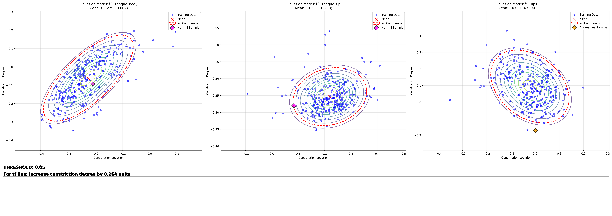

# SSL-SI-tool-w_plot_gaussiam 

Forked from [SSL-SI-tool] (https://github.com/Yashish92/SSL-SI-tool)
* Author: Yashish Maduwantha
* Email: yashish@terpmail.umd.edu

Main Updates in this repo: 
Inspired from paper [Subtyping Speech Errors in Childhood Speech Sound Disorders with Acoustic-to-Articulatory Speech Inversion](https://www.isca-archive.org/interspeech_2025/benway25_interspeech.pdf) by 
* ![plot] (examples/plot/plots_2025-09-02_14-35-18/phoneme_comparison_combined_ɪ_ʃ_t_ɪ_s_t_i_t͡ʃ_t.png) 
* 
* plot and gaussian models only available currently for xrmb not hprc. 
* current in experiment phase, gaussian model feedback sensitivity is high, for your experiment please adjust to your desired threshold. 


## Description
The SSL-SI-tool implements the pipeline which can be directly used to estimate the articulatory features (6 TVs or 9 TVs + source features) given the speech utterance (.wav files).

This repository holds two Acoustic-to-Articulatory Speech Inversion (SI) systems trained on the Wisconsin XRMB dataset and the HPRC dataset respectively. The model architecture and training are based on the papers [Improving Speech Inversion Through Self-Supervised Embeddings and Enhanced Tract Variables](https://ieeexplore.ieee.org/abstract/document/10715399), [Audio Data Augmentation for Acoustic-to-articulatory Speech Inversion](https://arxiv.org/abs/2205.13086) and ["Acoustic-to-articulatory Speech Inversion with Multi-task Learning"](https://www.isca-speech.org/archive/pdfs/interspeech_2022/siriwardena22_interspeech.pdf). The pretrained SI systems in this repository have been trained with self-supervised based features (HuBERT and wavLM) as acoustic inputs compared to the 13 MFCCs used in the papers above. Check the two papers above to refer to more information on the types of TVs estimated by each model. 

1. Model trained on XRMB dataset : Estimates 6 TVs
2. Model trained on HPRC dataset : Trained with a MTL framework and estimates 9 TVs + Source features (Aperiodicity, Periodicity and Pitch)

## Installation Guide

Follow steps in [run_instructions.txt](run_instructions.txt) to get started quickly !!

The SI systems were trained in a conda environment with Python 3.8.13 and tensorflow==2.10.0. The HuBERT pretrained models used to extract acoustic features have been trained in PyTorch.

1. Installation method 1:

First install tensorflow and we recommend doing that in Conda following the steps [here](https://www.tensorflow.org/install/pip).

We also use a number of off the shelf libraries which are listed in [requirements.txt](requirements.txt). Follow the steps below to install them.

```bash
$ pip install speechbrain
$ pip install librosa
$ pip install transformers
```

2. Installation method 2 : Installing inidividual libraries from the [requirements.txt](requirements.txt) file.
```bash
$ pip install -r requirements.txt
```

We recommed following method 1 since it will automatically take care of compatible libraries incase there have been new realase versions of respective libraries.

Note : If you run the SI system on GPUs to extract TVs (recommended for lareger datasets), make sure the cuDNN versions for pyTorch (installed by speechbrain) and the one installed with Tensorflow are compatible.

## Run SI tool pipeline

Execute [run_SSL_SI_pipeline_custom.py](1_run_SSL_SI_pipeline_custom.py) script to run the SI pipeline which performs the following 'steps',

1. Run [feature_extract.py](feature_extract.py) script to do audio segmentation and extract specified SSL features using the [speechbrain](https://github.com/speechbrain/speechbrain/) library
2. Load the pre-trained SSL-SI model and evaluate on the extracted SSL feature data generated in step 1 
3. Save the predicted Tract Variables (TVs)

Execute [1_folder_restructur.py](1_folder_restructur.py) script to restruct files to 1 folder 

Execute [2_data_collection.py](2_data_collection.py) script to extract feature datas from .npy files. 

Execute [3_plot_multip](3_plot_multip.py)script to generate plot 

Execute [4_gaussian.py](4_gaussian.py)script to generate gaussian models and get gaussian plot and simple feedback. 

2-4 has additional script with _ignore_context, which give you the possibility to ignore context info. But use that only when you are sure you want to ignore coarticulations. 

## Tract Variables Output

The tract variables can be saved as either numpy files or mat files for convenience. The TVs and source features are saved in the following order in the output files.

1. 6TVs with XRMB : LA, LP, TBCL, TBCD, TTCL, TTCD
2. 12 TVs with HPRC : LA, LP, TBCL, TBCD, TTCL, TTCD, JA, TMCL, TMCD, Periodicity, Aperiodicity, Pitch (normalized to 0 to 1 range)

### Python command line usage:
```bash
usage: run_SSL_SI_pipeline.py [-h] [-m MODEL] [-f FEATS] [-i PATH]
                              [-o OUT_FORMAT]

Run the SI pipeline

optional arguments:
  -h, --help            show this help message and exit
  -m MODEL, --model MODEL
                        set which SI system to run, xrmb trained (xrmb) or
                        hprc trained (hprc)
  -f FEATS, --feats FEATS
                        set which SSL pretrained model to be used to extract
                        features, hubert to use HuBERT-large and wavlm to use
                        wavLM-large pretrained models
  -i PATH, --path PATH  path to directory with audio files
  -o OUT_FORMAT, --out_format OUT_FORMAT
                        output TV file format (mat or npy)

```

### Example for running the ML pipeline

1. Run the pipeline from end to end (executes all 3 steps) to extract features 
```python
python 1_run_SSL_SI_pipeline_custom.py -m xrmb -f hubert -c path/to/csv/file -o 'npy'
```

2. Put all subfolder to one folder, update folder location in script line 73  and reconstruct the folder 
```python
python 1_folder_restructur.py 
```

3. collect feature data 
```python
python 2_data_collection.py /path/to/npy/folder /path/to/testclean/folder ɪ_ʃ_t ɪ_s_t i_t͡ʃ_t
```

4. plot 
```python
python 3_plot_multip.py path/to/csv/from/2nd/step <phoneme_combinations>
```

5. gaussian 
```python
python 4a_gaussian.py --train-csv xx.csv --eval-csv xxx.csv --phoneme-combinations xxx --threshold optional --load_model xxoptional 
```
you can adjust threshold to control the sensitiveness, you can also use load_model to use existing model. if no eval csv then the script will just generate gaussian models. 

6. general information 
#ignore context example:  ʃ s t͡ʃ z θ ð ʒ 
#with context example: ɪ_ʃ_t ɪ_s_t i_t͡ʃ_t 


## License
This project is licensed under the LICENSE-CC-BY-NC-ND-4.0 - see the LICENSE file for details
